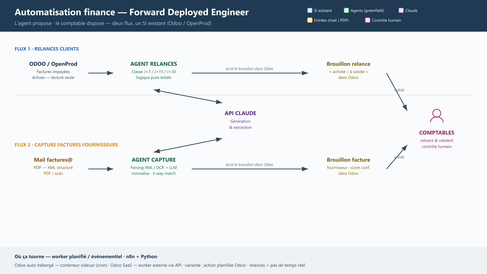
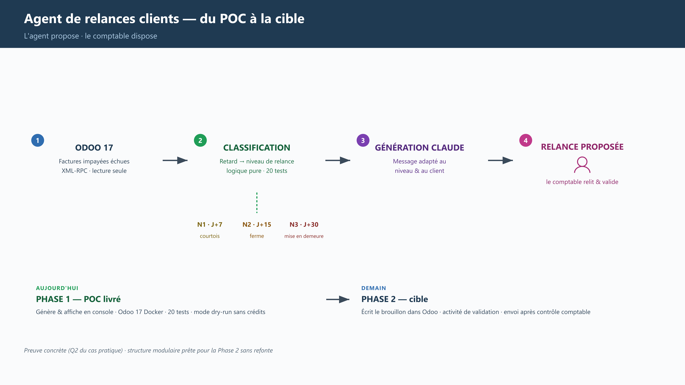

# poc-agent-relance-conserverie

POC d'un agent IA (Claude via l'API Anthropic) qui automatise les **relances de factures impayées** pour une PME comptable équipée d'Odoo.

**Phase 1 (périmètre actuel) :** Odoo 17 tourne en local (Docker), un agent Python récupère les factures clients impayées et échues via XML-RPC, les classe par niveau de relance, génère un message personnalisé avec Claude, et **affiche** le résultat. **Aucun envoi réel, aucune écriture dans Odoo.**

> Documents de référence : [`.claude/skills/project-brief.md`](.claude/skills/project-brief.md) (le _quoi_) et [`.claude/skills/working-rules.md`](.claude/skills/working-rules.md) (le _comment travailler_).

---

## Architecture

Principe directeur : **l'agent propose, le comptable dispose**. Toute sortie est un
brouillon relu et validé par un humain — contrôle humain systématique, surtout au démarrage.

Vue d'ensemble — deux flux complémentaires sur le SI existant (Odoo / OpenProd) :



Zoom sur le flux couvert par ce POC — les relances clients, du livré à la cible :



> Sources vectorielles : [`architecture.svg`](docs/architecture/architecture.svg) ·
> [`relances-une-diapo.svg`](docs/architecture/relances-une-diapo.svg)

---

## 1. Prérequis

| Outil         | Version   | Notes                                                               |
| ------------- | --------- | ------------------------------------------------------------------- |
| Docker Engine | récent    | Avec le plugin **Docker Compose v2** (`docker compose`, sans tiret) |
| Python        | **3.11+** | Pour l'agent (Phase B)                                              |
| WSL2          | (Windows) | Lancer Docker Desktop avec l'intégration WSL2 activée               |

Vérifier l'installation :

```bash
docker --version
docker compose version
python3 --version
```

> **WSL2 :** travaillez dans le système de fichiers Linux (`~/...`), **pas** dans `/mnt/c/...`. Les volumes Docker utilisés ici sont des volumes nommés (pas de bind-mount Windows), ce qui évite les problèmes de permissions et de performances. **Clonez le repo dans le home Linux WSL2** (ex. `~/poc-agent-relance`), pas dans `/mnt/c/...` (chemins Windows lents sur Docker → lag I/O, timeouts possibles).

```bash
# ✅ BON (dans le home Linux WSL2)
cd ~
git clone <url> poc-agent-relance
cd poc-agent-relance
docker compose -f docker/docker-compose.yml up -d

# ❌ MAUVAIS (depuis un chemin Windows monté)
cd /mnt/c/Users/.../poc-agent-relance   # lag I/O, timeouts possibles
docker compose -f docker/docker-compose.yml up -d
```

---

## 2. Setup Odoo (Docker)

Depuis la racine du projet :

```bash
docker compose -f docker/docker-compose.yml up -d
```

Cela démarre deux conteneurs : `conserverie_postgres` (PostgreSQL 15) et `conserverie_odoo` (Odoo 17). Odoo n'accepte les connexions qu'une fois Postgres sain (`healthcheck`).

Suivre le démarrage :

```bash
docker compose -f docker/docker-compose.yml logs -f odoo
```

Quand le log affiche `HTTP service (werkzeug) running on ...`, ouvrir :

> **http://localhost:8069**

> ⏳ Odoo peut afficher ce message **avant** d'être 100 % prêt côté UI. Si le Database Manager n'apparaît pas (page blanche ou timeout), attendre ~10 s de plus et **rafraîchir** la page.

### Création de la base

Au premier lancement, Odoo affiche le **Database Manager**. Renseigner :

| Champ              | Valeur                                                      |
| ------------------ | ----------------------------------------------------------- |
| Master Password    | (au choix — mot de passe maître Odoo)                       |
| Database Name      | **`conserverie`** (doit correspondre à `ODOO_DB` du `.env`) |
| Email              | **`admin`**                                                 |
| Password           | **`admin`**                                                 |
| Language / Country | Français / France                                           |
| **Demo data**      | ☑️ **cocher « Load demonstration data »**                   |

Cliquer sur **Create database**. Odoo initialise la base (~1 min) puis ouvre la session `admin` / `admin`.

> ℹ️ Les données de démo s'activent **ici**, via la case à cocher — il n'existe pas de variable d'environnement Docker pour ça.

### Configuration de l'agent

Préparer le fichier d'environnement de l'agent (Phase B) :

```bash
cp .env.example .env
# puis editer .env : renseigner ANTHROPIC_API_KEY (les valeurs Odoo conviennent par defaut)
```

---

## 3. Validation du setup

Avant d'écrire l'agent, vérifier que l'environnement est conforme aux hypothèses du brief :

- [ ] Les deux conteneurs tournent :
  ```bash
  docker compose -f docker/docker-compose.yml ps
  ```
- [ ] Odoo répond sur http://localhost:8069 et la session `admin` / `admin` fonctionne.
- [ ] La base **`conserverie`** existe (visible dans le Database Manager : `/web/database/manager`).
- [ ] Le module **`account` (Comptabilité / Facturation)** est installé : menu **Apps** → retirer le filtre « Apps » → chercher _Invoicing/Accounting_ → **Install** si absent (le module fournit le modèle `account.move`).
- [ ] Des factures clients de démo sont présentes : menu **Comptabilité → Clients → Factures**.
- [ ] **Au moins 1 facture client de démo existe.** Si la liste est vide, la base a probablement été créée **sans** cocher « Load demonstration data » : revenir au Database Manager (`/web/database/manager`), **supprimer** la base `conserverie`, puis la **recréer en cochant « Demo data »** (étape 2).

---

## 4. Données de test

Le POC est en **lecture seule**. Pour valider toute la chaîne (filtrage + classification + génération) avant la démo, créer **au moins 6 factures** couvrant les variantes du brief §4. Les factures « à relancer » sont réparties sur **2 clients** pour un rendu réaliste.

| #   | Client   | État / paiement            | Échéance | Attendu par l'agent                    |
| --- | -------- | -------------------------- | -------- | -------------------------------------- |
| 1   | Client A | Brouillon (`draft`)        | —        | **ignorée** (non comptabilisée)        |
| 2   | Client A | Payée (`paid`)             | —        | **ignorée**                            |
| 3   | Client B | Payée (`paid`)             | —        | **ignorée**                            |
| 4   | Client A | Impayée échue              | **J+8**  | relance **niveau 1** (courtois)        |
| 5   | Client B | Impayée échue              | **J+20** | relance **niveau 2** (ferme)           |
| 6   | Client B | Partiellement payée, échue | **J+35** | relance **niveau 3** (mise en demeure) |

> Calcul du retard : `aujourd'hui − date d'échéance`. Pour obtenir un retard précis (J+8, J+20, J+35), fixer la **date d'échéance** de la facture en conséquence (champ _Date d'échéance_ / `invoice_date_due`).

**Création d'une facture** (rappel) : Comptabilité → Clients → Factures → **Nouveau** → choisir le client, ajouter une ligne, définir la **date d'échéance**, puis **Confirmer** (passe en `posted`). Pour une facture « payée », utiliser **Enregistrer un paiement** ; pour « partiellement payée », enregistrer un paiement d'un montant inférieur au total.

> **Recommandé — seed automatique.** Plutôt que la saisie manuelle, le script `docker/fixtures/create_invoices.py` crée les **2 clients + 6 factures** contrôlées (échéances échelonnées **J+8 / J+20 / J+35** calculées par rapport au jour courant), ce qui rend la démo **reproductible** :
>
> ```bash
> python docker/fixtures/create_invoices.py     # lit .env ; voir §6 pour le venv
> ```
>
> Prérequis : base recréée **sans** « Load demonstration data » (cf. §2) pour éviter le bruit, et `.env` renseigné. Le seed **écrit** dans Odoo (outil de setup) — l'agent, lui, reste strictement en lecture seule.

---

## 5. Commandes utiles

```bash
# Démarrer / arrêter (sans perdre les données)
docker compose -f docker/docker-compose.yml up -d
docker compose -f docker/docker-compose.yml stop

# Logs
docker compose -f docker/docker-compose.yml logs -f odoo
docker compose -f docker/docker-compose.yml logs -f postgres

# État des conteneurs
docker compose -f docker/docker-compose.yml ps

# Arrêt + suppression des conteneurs (les volumes/données SURVIVENT)
docker compose -f docker/docker-compose.yml down

# ⚠️ RESET COMPLET : supprime conteneurs ET volumes (base Odoo + Postgres effacées)
docker compose -f docker/docker-compose.yml down -v
```

> Après un `down -v`, tout est remis à zéro : il faudra recréer la base `conserverie` et les données de test (étapes 2 à 4).

---

## 6. Lancement du POC

### Installation de l'agent (Python)

```bash
python3 -m venv .venv
source .venv/bin/activate
pip install -r requirements.txt          # + requirements-dev.txt pour lancer les tests
cp .env.example .env                      # puis renseigner ANTHROPIC_API_KEY
```

> **WSL2 / Debian — `python3 -m venv` échoue (`ensurepip is not available`) ?**
> Installer le paquet : `sudo apt install python3-venv`, puis recréer le venv.
> Sans accès `sudo` : `python3 -m venv --without-pip .venv` puis bootstrap de pip
> (`curl -sS https://bootstrap.pypa.io/get-pip.py | .venv/bin/python`).

### Exécution

```bash
# Cycle complet : fetch Odoo -> classification -> génération Claude -> affichage
python -m src.main

# Classification seule, sans appel à Claude (utile tant que le compte API n'a pas de crédits)
python -m src.main --dry-run

# Tracebacks complets en cas d'erreur
python -m src.main --debug
```

L'agent lit `.env`, se connecte à Odoo en **XML-RPC (lecture seule)**, récupère les factures impayées échues, les classe par niveau (1/2/3 selon J+7 / J+15 / J+30) et affiche les messages de relance générés par Claude. **Aucun envoi réel, aucune écriture dans Odoo.**

> **💳 Crédits API requis.** La génération réelle appelle l'API Anthropic, facturée à l'usage — **distincte de l'abonnement Claude Pro** (claude.ai). Créditer le compte sur `console.anthropic.com` → **Plans & Billing** (quelques dollars suffisent ; une relance ≈ quelques centimes). Sans crédits, utiliser `--dry-run`.

### Tests

```bash
pip install -r requirements-dev.txt
pytest -q
```
